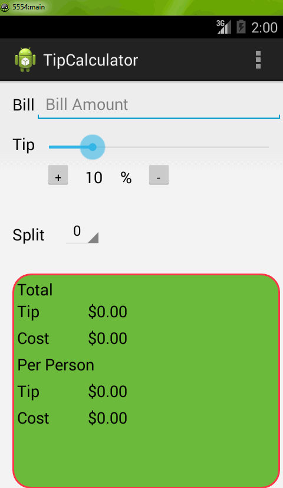

This is Android App to calculate Tip.

Time Spent: 12 hours

Completed User stories:

1. User enters the total amount of the transaction
2. User can select between tip amounts (i.e 10%, 15%, 20%)
3. Upon selecting tip amount, formatted tip value is displayed

Optional:

1. User changes the total amount and updated tip is reflected automatically
2. User can select custom tip percentage if desired
3. User can select how many ways to split the tip
4. Experiment with seek bar and spinner input widgets

